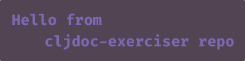

= cljdoc Asciidoctor features
:toc: macro
:toclevels: 6
:figure-caption!:
:stem:

In an Asciidoctor article, a preamble comes before the first section.

toc::[]

== Introduction
A test AsciiDoctor doc to exercise cljdoc formatting and features.

This document exists to compare basic features with CommonMark. If you edit this
doc please also edit its link:md-features.md[CommonMark counterpart].

AsciiDoctor offers a very rich set of formatting options, see the
link:asciidoctor-user-manual.adoc[AsciiDoctor User Manual] for all the details.

== Formatting marks

I have a *strong* feeling that I might be head**strong**.

If I use _italics_ does that make things more g__lean__able?

Does this [.line-through]#strike# you as a [.line-through]##cross##word?

My `code` was en``coded``ed.

I am ^super^ excited about this ~sub~routine.

A line break +
can be useful.

== Code blocks
Here we have some clojure code :

[source,clojure]
----
;; some sweet clojure code

(defn hello-earthling
  "Greet an earthling in a believable way."
  [name]
  (println "Hello earthling " (uppercase name)))
----

If we specify `clojure-repl` to Asciidoctor as our language, we can invoke special highlighting for a repl session:

[source,clojure-repl]
----
user=> (require '[clojure.string :as string])
nil
user=> (string/reverse "step on no pets")
"step on no pets"
user=> (reduce + 0 [1 2 3 4 5 6 7 8 6])
42
user=>
----

Asciidoctor also supports callouts and titles:

.code-block-title
[source,clojure]
----
;; some sweet clojure code

(defn hello-earthling
  "Greet an earthling in a believable way."  ;; <1>
  [name]
  (println "Hello earthling " (uppercase name))) ;; <2>
----
<1> a docstring comes before the arguments
<2> check with an earthling if uppercasing is soothing

== Lists

Bulleted:

* apples
* orange
** temple
** navel
* bananas

Numbered:

. first
.. a
.. b
... x
... y
. second
. third

Mixed:

* Hey
.. one
.. two
* Ho
** Ho
... uno
... dos

With code:

. one
.. two
+
----
I am a code block
----

.. three

Description list:

Clojure:: Clojure for the JVM
ClojureScript:: Clojure for JavaScript compiled by the JVM
Plank:: Clojure for JavaScript compiled by JavaScript
Babashka:: Clojure for the command line

Description list (horizontal):

[horizontal]
Clojure:: Clojure for the JVM
ClojureScript:: Clojure for JavaScript compiled by the JVM
Plank:: Clojure for JavaScript compiled by JavaScript
Babashka::bb:: Clojure for the command line

Description list (Q&A):

[qanda]
Why?::
  Because
How?:: Dunno

== Quoted text

____
Quoted text.

Another paragraph in quote.
____

In Asciidoctor, quotes can also include the author and citation:

[quote,Yogi Berra,life]
____
I never said most of the things I said.
____

> CommonMark syntax
>
> Another paragraph in quote.
>
> > nested quote
>
> back to non-nested

And yet another syntax:

"I hold it that a little rebellion now and then is a good thing,
and as necessary in the political world as storms in the physical."
-- Thomas Jefferson, Papers of Thomas Jefferson: Volume 11

== Images
This local image should work on github and cljdoc.

image::/images/test-image-1.png[«A local test image should appear here»]

The same image can be referenced relative to this document:

Here's a remote image:

image::https://picsum.photos/id/1041/400/100[«A remote test image should appear here»]

How about captions, do we display those nicely?

.Test image caption
image::/images/test-image-1.png[«A local test image should appear here»]

And here's an inline image:https://picsum.photos/id/787/100/100[«A remote test image should appear here»] image.

== Links

Local link: link:md-features.md[cljdoc markdown features]

Local link root relative: link:/doc/tests/md-features.md[cljdoc markdown features]

SCM link: link:excluded.md[scm link]

SCM link root relative: link:/doc/tests/excluded.md[scm link]

External link: https://asciidoctor.org/docs/asciidoc-vs-markdown[AsciiDoc vs Markdown]

Link to anchor: <<anchorid>>

Wikilinks are only for CommonMark in docstrings.

Let's try referencing our APIs via fully qualified links:

1. https://cljdoc.org/d/org.cljdoc/cljdoc-exerciser/CURRENT/api/cljdoc-exerciser.core#exercise3[A link to cljdoc-exerciser.core/excercise3]
2. https://cljdoc.org/d/org.cljdoc/cljdoc-exerciser/CURRENT/api/cljdoc-exerciser.core[A link to cljdoc-exerciser.core]

== Headings
=== Level 3
==== Level 4
===== Level 5
====== Level 6

== Horizontal rule

This is how a horizontal rule is rendered:

'''

== Tables

AsciiDoc tables are quite full featured.

Here is the most basic example:

|===
| Heading 1 | Heading 2

| col1, row1
| col2, row1

| col1, row2
| col2, row2

| col1, row3
| col2, row3

| col1, row4
| col2, row4
|===

Sophisticated alignment support is also available, here is a basic example:

[cols=">,^,<"]
|===
| Right aligned col | Centered col | Left aligned Col

| am
| is
| any

| I
| this
| thing

| right?
| centered?
| left?
|===

Here's the same table with a title

.This time with a title
|===
| Heading 1 | Heading 2

| col1, row1
| col2, row1

| col1, row2
| col2, row2
|===

And here's a nested table example from Asciidoctor user manual:

[cols="1,2a"]
|===
| Col 1 | Col 2

| Cell 1.1
| Cell 1.2

| Cell 2.1
| Cell 2.2

[cols="2,1"]
!===
! Col1 ! Col2

! C11
! C12

!===

|===

Here's a table with custom sizing:

[cols="10,40,20,~",options="header"]
|====
|10% width
|40% width
|20% width
|remaining

|a
|b
|c
|d

|e
|f
|g
|h

|i
|j
|k
|l

|m
|n
|o
|p
|====

An autowidth table will only be as wide as it needs to be.footnote:[file, grabbed from asciidoctor user manual]

[%autowidth]
|===
|Name of Column 1 |Name of Column 2 |Name of Column 3

|Cell in column 1, row 1
|Cell in column 2, row 1
|Cell in column 3, row 1

|Cell in column 1, row 2
|Cell in column 2, row 2
|Cell in column 3, row 2
|===

A table with some inline code to exercise https://github.com/cljdoc/cljdoc/issues/805

|===
|Col1

|Single element: `x`
|Multiple code elements: `x` `y`
|===

== Emojis

Asciidoctor does not support codes like GitHub flavored markdown does, but it does have support for icons when font-awesome is enabled.

icon:heart[] icon:heart[size=2x]

Note that GitHub does support their own emojis in adoc files as a post-processing feature:

bear :bear: smirk :smirk: grin :grin:

[#anchorid]
== Anchored heading
And here we are.

== Admonitions
From most serious to least:

IMPORTANT: Important things are said here.

WARNING: Warning to the wise.

CAUTION: Aren't you a caution?

NOTE: Note that this note is a note.

TIP: Tip the scales with a tip.

And how do admonitions look with some code in them?

[IMPORTANT]
====
This admonition has some `code` in it.

[source,clojure]
----
(how
  (does
    (this "look?)))
----
====

[WARNING]
====
This admonition has some `code` in it.

[source,clojure]
----
(how
  (does
    (this "look?)))
----
====

[CAUTION]
====
This admonition has some `code` in it.

[source,clojure]
----
(how
  (does
    (this "look?)))
----
====

[NOTE]
====
This admonition has some `code` in it.

[source,clojure]
----
(how
  (does
    (this "look?)))
----
====

[TIP]
====
This admonition has some `code` in it.

[source,clojure]
----
(how
  (does
    (this "look?)))
----
====

== Text Roles

In the days of yore, Asciidoctor supported various text roles.
Today, the Asciidoctor team recommends you setup what makes sense for your docs in your CSS.
For now, we do not support these legacy roles for cljdoc.

The following subsections demonstrate that we do not support these roles.
Well, except for [underline]#underline#.

=== size
Text can be [big]#Big# or [small]#small#.

=== lines

We can add [underline]#underline#, [overline]#overline# and
[line-through]#line-through#.

=== foreground color

We have a choice of 16 foreground colors: [aqua]#aqua# [black]#black#
[blue]#blue# [fuchsia]#fuschia# [gray]#gray# [green]#green# [lime]#lime#
[maroon]#maroon# [navy]#navy# [olive]#olive# [purple]#purple# [red]#red#
[silver]#silver# [teal]#teal# [white]#white# [yellow]#yellow#.

=== background color

The same 16 colors are available as background colors: [aqua-background]#aqua#
[black-background]#black# [blue-background]#blue# [fuchsia-background]#fuschia#
[gray-background]#gray# [green-background]#green# [lime-background]#lime#
[maroon-background]#maroon# [navy-background]#navy# [olive-background]#olive#
[purple-background]#purple# [red-background]#red# [silver-background]#silver#
[teal-background]#teal# [white-background]#white# [yellow-background]#yellow#

=== combinations
Roles can be combined, some examples:
[white black-background]#white on black-background#
[red yellow-background]#red on yellow background#
[big blue line-through fuchsia-background]#big blue line-through maroon-background#

== Math

AsciiDoc STEM supports mathematical equations via MathJax.

To enable stem support for your doc add in the `:stem:` document attribute.
This is where you can provide your default syntax for example:

----
:stem: latexmath
----

Specifying nothing sets the default for `stem` blocks to `asciimath`.
But, you can always be specific.
Instead of specifying `stem` for your formulas, you can explicitly specify `asciimath` or `latexmath` instead.
To each is own, but I think I'd be specific.

Here is a Latex example:
[latexmath]
++++
\[ f(n) =
  \begin{cases}
    n/2       & \quad \text{if } n \text{ is even}\\
    -(n+1)/2  & \quad \text{if } n \text{ is odd}
  \end{cases}
\]
++++

And one for AsciiMath:
[asciimath]
++++
sum_(i=1)^n i^3=((n(n+1))/2)^2
++++

And AsciiMath again using `stem` instead of being specific:
[stem]
++++
sum_(i=1)^n i^3=((n(n+1))/2)^2
++++

Here's an example latexmath:[\forall x \in X, \quad \exists y \leq \epsilon] of an inlined expression.

== Drawings

Do we support svgbob? Not yet but if we someday decide to, this sample from the svgbob demo site won't look like ASCII art.

[svgbob]
....
              .─.
             ( 0 )
              `-'
            /     \
           /       \
          V         V
         .─.         .─.
        ( 1 )       ( 4 )
         `-'         `-' .
       /   \         |  \ `.
      /     \        |   \  `.
     V       V       |    \   `.
    .─.      .─.     V     V    V
   ( 2 )    ( 3 )    .─.   .─.   .─.
    `─'      `─'    ( 5 ) ( 6 ) ( 7 )
                     `─'   `─'   `─'
....

== Embedded html

Although it is discouraged, Asciidoctor does support passthroughs.

Asciidoctor renders pass:[<b>passed through</b>] embedded html.

What can't you do in embedded HTML?

Is there any limits to what HTML you can use? It does not seem like it.
Seems to me like you can reference existing CSS classes and also specify inline styles.
I can't imagine that GitHub allows such freedom though, and neither does cljdoc.
++++
<table>
  <tr>
    <td class="red">1</td>
    <td class="green">2</td>
    <td style="background-color: orange">3</td>
  </tr>
</table>
++++

Like GitHub, cljdoc sanitizes HTML, removing any JavaScript.
For example:
++++

Original content, JavaScript inactive. 

++++

Here we tell JavaScript to popup and alert, something that cljdoc will not allow:
++++

++++

== Keyboard keys

Asciidoctor supports the keyboard macro which is a handy way to show what keys to press.

kbd:[q] kbd:[w] kbd:[e] kbd:[r] kbd:[t] kbd:[y]

On macOS press kbd:[⌘+⌥+space] to bring up Finder search.

== Menu selections

Select menu:View[Zoom > Reset] to reset the zoom level to the default setting.

== UI buttons

Press the btn:[OK] button when you are finished.

== Index terms

Asciidoctor supports defining index terms but does not yet support generating an index catalog via its html converter.
So we don't either.

This example ((term1-should-show)) contains some index terms (((term2-hidden, term3-hidden, term4-hidden))) just to make sure we don't barf on them.

== Example Block

An example block can be used to illustrate some syntax or usage.

.I am a sample
====
Do I look like a subdoc?

[listing]
....
Some syntax here
....

Blah blah
====

An example can also be collapsible

.I am a sample
[%collapsible]
====
Do I look like a subdoc?

[listing]
....
Some syntax here
....

Blah blah
====

== Verse

[verse, Lee, Testing Verse]
____
     I am not
    adverse
   to
  testing
 verse

 or
   am
      I?
____

== Side bars

Side bars are for content outside the normal flow of your document.

.How much chuck?
****
How much wood could a woodchuck chuck
If a woodchuck could chuck wood?
As much wood as a woodchuck could chuck,
If a woodchuck could chuck wood.
****

== Open blocks

Not sure why adoc has these, but they can exist.
They are blocks that masquerade as other blocks.
I think they are here for extensibility?

[abstract]
--
I am abstract.
--

[whatami]
--
What am I?
--

== Video

Asciidoctor explicitly supports videos with a variety of options, something that cljdoc does not currently support.

Here's a youtube video with default options:

.Simplicity Matters by Rich Hickey
video::rI8tNMsozo0[youtube]

And here's one from vimeo:

.Introduction to Clojure by Stuart Halloway
video::68375202[vimeo]

And one from the archive.org:

.Big Buck Bunny
video::https://archive.org/download/BigBuckBunny_124/Content/big_buck_bunny_720p_surround.mp4[poster=https://peach.blender.org/wp-content/uploads/title_anouncement.jpg?x11217,opts="muted,loop",start=60,end=70]

== Audio

Asciidoctor also allows audio play, cljdoc does not currently support this.

audio::https://upload.wikimedia.org/wikipedia/commons/3/3c/01_-_Vivaldi_Spring_mvt_1_Allegro_-_John_Harrison_violin.ogg[]

== Things we ignore

Page breaks `<<<`

<<<

== Discrete Heading

If you want the visual affect of a heading without the semantics.

[discrete]
== This header is not part of the hierarchy and will not be part of toc

[float]
=== Ditto for this header
